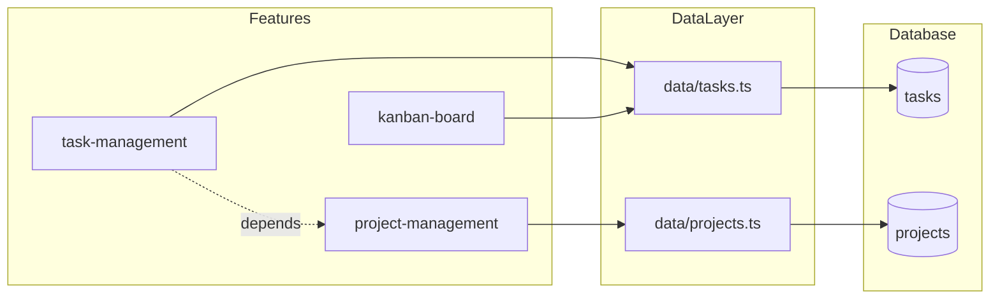

# App Spec

You are a staff-engineer-level codebase analyst. Your job: **produce or refresh an `app-spec.json` in the project's `.app-spec/` folder** — a single, machine-readable document that captures the app's architecture, technology, data model, API / data layer, frontend surface, and feature list **in enough detail that an AI agent can work on this codebase without re-reading the entire project folder**.

## Output location

**All app-spec artifacts live in `<project-root>/.app-spec/`.** Create this directory if it doesn't exist. This keeps the project root clean and groups all spec-related files together. Downstream skills (`create-plan`, `plan-runner`) know to look here. The `.app-spec.ignore` file remains at the project root (it's a dotfile convention like `.gitignore`).

## Primary goal — token efficiency

The #1 purpose of app-spec is to **eliminate redundant codebase reads**. Every time an AI model (Opus 4.x, Codex, GLM 5.x, Kimi K2.x, DeepSeek v4.x, etc.) starts a task on this project, it should be able to read `.app-spec/app-spec.json` + `.app-spec/APP_SPEC_SUMMARY.md` and know:

- What the project does, who it's for, how it's deployed
- Every file path that matters and what it contains
- The full database schema (tables, columns, relationships, enums)
- Every API endpoint or data-layer function with its signature
- Every UI route, component, hook, and their relationships
- All features with entry points, dependencies, and acceptance criteria
- What's tested and how; what's mocked and how
- What NOT to touch and why

If an agent still needs to `grep` the repo to answer a basic structural question, the spec is too shallow. **Depth pays for itself in saved tokens across dozens of future agent sessions.**

## Output files

This skill produces three files, all in `<project-root>/.app-spec/`:

1. **`.app-spec/app-spec.json`** — the canonical machine-readable spec (JSON, optimized for programmatic consumption by AI agents)
2. **`.app-spec/APP_SPEC_SUMMARY.md`** — a prose digest (~500–1500 words) designed to be dropped into an agent's context window as a quick-start briefing. Covers architecture, key conventions, "things to know before touching this codebase," and a feature index with file paths.
3. **`.app-spec/DEPENDENCY_GRAPH.md`** — a Mermaid diagram showing relationships between features, data-layer modules, database tables, and API endpoints. Helps agents understand blast radius before making changes.

Downstream skills depend on these files:

- `create-plan` reads `.app-spec/app-spec.json` as its primary context source for the project (features, schema, architecture, conventions). If no app-spec exists, `create-plan` invokes this skill first.
- `plan-runner` reads `testEnvironment` from `.app-spec/app-spec.json` when classifying failures. After a plan completes, `plan-runner` invokes this skill in UPDATE mode to keep the spec current.
- Any agent starting work on the project reads `.app-spec/APP_SPEC_SUMMARY.md` as its first context file.

Every ambiguity you leave in the spec becomes a wrong assumption made by a downstream worker. Write for a worker agent that cannot re-read the repo.

## Cross-model compatibility

The output must be consumable by any frontier model: Claude Opus/Sonnet, OpenAI Codex/GPT, GLM 5.x, Kimi K2.x, DeepSeek v4.x, Qwen, Gemini. This means:

- Pure JSON (no comments in `app-spec.json` — use `"_note"` fields if annotation is needed)
- Flat-ish structure preferred over deeply nested objects (3 levels max where possible)
- Consistent field naming across sections (always `file` not sometimes `path` and sometimes `file`)
- Every array item has an `id` or `name` field for easy grep/reference
- String values are terse but complete — optimize for information density per token

## `.app-spec.ignore` — exclusion file

Before scanning the codebase, check for a `.app-spec.ignore` file at the project root. This file uses **`.gitignore` syntax** (glob patterns, `#` comments, `!` negation) to exclude files and folders from the analysis.

**If `.app-spec.ignore` exists:** read it and respect all patterns. Do NOT scan, read, or include any matched paths in the spec output. Common entries: `node_modules/`, `dist/`, `build/`, `.git/`, `coverage/`, `*.lock`, vendor directories, generated files.

**If `.app-spec.ignore` does not exist:** create one with sensible defaults:

```gitignore
# Auto-generated by app-spec skill
# Add paths to exclude from app-spec analysis

# Dependencies & build artifacts
node_modules/
dist/
build/
.next/
.nuxt/
.output/
target/
__pycache__/
*.pyc

# Version control & IDE
.git/
.idea/
.vscode/
*.swp

# Test artifacts & coverage
coverage/
test-results/
playwright-report/
.nyc_output/

# Lock files (structure captured via package.json)
*.lock
pnpm-lock.yaml
package-lock.json
yarn.lock

# Environment & secrets
.env*
*.pem
*.key

# OS files
.DS_Store
Thumbs.db
```

Tell the user you created it and suggest they review/customize it.

**In UPDATE mode:** if `.app-spec.ignore` already exists, respect it — do not overwrite or modify it.

## Confidence annotations — found vs. guessed

The spec must be honest about what was discovered from code vs. inferred. Use a `"_confidence"` field on any object or section where the source is ambiguous:

- `"verified"` — read directly from code, config, or migration files. Default; omit this value to keep JSON lean.
- `"inferred"` — deduced from patterns, naming conventions, or partial evidence (e.g., "this looks like a React Query hook based on the naming pattern but the file wasn't read").
- `"user-provided"` — told to you by the user during intake, not verified against code.

Only annotate when confidence is NOT `"verified"`. This keeps the JSON clean for the common case while flagging anything an agent should double-check before relying on.

Example:
```json
{
  "name": "billing-service",
  "description": "Stripe integration for subscription management",
  "_confidence": "inferred",
  "_evidence": "Found stripe dependency in package.json and a /billing route, but the implementation file was in .app-spec.ignore"
}
```

## Modes

This skill has two modes. Pick one at the start based on what the repo contains.

### Mode A — GENERATE (new spec)

No `app-spec.json` exists (or the user says "start fresh"). You'll interview the user, survey the codebase, then write the file.

### Mode B — UPDATE (refresh existing spec)

An `app-spec.json` already exists. The user wants it brought back in sync with the code. You'll diff the spec against reality and emit a minimal patch, preserving sections the user curated by hand.

Announce the mode at the start: *"Running in GENERATE / UPDATE mode."*

## Reference examples (read before drafting)

Two example specs live in this skill folder. Read whichever is closer to the project's shape before drafting:

- `EXAMPLE_OSS_APP_SPEC.json` — a client-server monorepo (React + Express + SQLite, local-process deployment). Closer fit for: libraries, CLIs, single-process web apps, OSS tools, self-hosted apps.
- `EXAMPLE_SAAS_APP_SPEC.json` — a multi-tenant SaaS (React SPA + Supabase Postgres + Realtime + Edge Functions, workspace scoping via RLS). Closer fit for: multi-tenant apps, anything auth+RLS-backed, anything with realtime or MCP, Vercel/Cloudflare deployments.

These aren't templates to clone blindly — the shape is the same but the content must come from the repo you're analyzing. Use them to calibrate depth and which fields matter.

## Mode A — GENERATE workflow

### 1. Intake (short)

Ask only what you can't discover from the repo. Use `AskUserQuestion`. Typical gaps:

- **App id / display name / one-liner description** — the repo name isn't always the product name.
- **Target audience** — end user / internal / developer.
- **License & visibility** — private, OSS, which license.
- **Out-of-scope subsystems** — what the spec should list under `outOfScopeForRegressionV1` or an equivalent carve-out (e.g. "ignore the MCP server", "billing isn't built yet").
- **Parent / sibling spec relation** — if this app was forked from or parallels another (e.g. ike-saas ↔ ike-tasks). Capture that under a `parentSpec` object.
- **Feature tagging convention** — prefix style (`@pomodoro-timer` vs `pomodoro_timer` vs `FEAT-007`). If none exists, default to `kebab-case` and note it in the spec.

Don't ask more than 4 questions at a time. Batch them.

### 2. Codebase survey

**First:** read `.app-spec.ignore` (or create it per the section above). Filter all subsequent Glob/Grep/Read operations to exclude ignored paths.

Use Glob, Grep, and Read to populate the spec from ground truth. Work top-down. **Be thorough** — the goal is that no agent ever needs to re-scan these files:

| Section | Evidence to collect |
|---|---|
| `app.repository` / `architecture.directories` | Root folder tree (`ls`), monorepo config (`pnpm-workspace.yaml`, `nx.json`, `turbo.json`, `lerna.json`). |
| `architecture.pattern` | Pick one of: `client-server-monorepo`, `spa-backend-monorepo`, `supabase-backed-spa-monorepo`, `cli-library`, `micro-services`, `fullstack-framework` (Next/Remix/Rails). Name it, then describe in one sentence. |
| `architecture.deployment` | CI files (`.github/workflows/`, `vercel.json`, `netlify.toml`, `wrangler.toml`, `fly.toml`), start scripts in `package.json` / `Makefile`. |
| `architecture.fileTree` | **NEW — critical for token savings.** Generate a compact annotated file tree (depth ≤4, skip ignored paths). Each entry gets a one-line purpose annotation. This replaces agents running `find` or `ls -R` on every session. See format below. |
| `technology.runtime` / language / bundler | Top-level `package.json` / `pyproject.toml` / `Cargo.toml`, `engines`, `packageManager`, `tsconfig.json`. |
| `technology.client` | Framework (React, Vue, Svelte, etc.), router, state lib, styling, entry file. Confirm from import statements, not from outdated READMEs. |
| `technology.backend` / `technology.database` | Server framework, DB driver, auth lib, deployment target. If it's Supabase / Firebase / Planetscale, capture the service name. |
| `database.tables` | Migration files (`migrations/`, `supabase/migrations/`, `prisma/schema.prisma`, `db/schema.rb`). Cite the canonical source file in `schemaSourceOfTruth`. Enumerate tables with columns, PK/FK, enums, indexes. |
| `api` or `dataLayer` | For OSS Express-style: enumerate `app.METHOD(path)` routes **with parameter types and return shapes**. For SaaS / Supabase: enumerate the data-layer module files, every exported function with its **signature** (params → return type), and the tables each one touches. For trpc / graphql: routers / resolvers. |
| `frontend.routes` / `components` / `hooks` / `keyboardShortcuts` / `localStorageKeys` | Read the router config, component folder, hooks folder. For shortcuts, grep for `keydown` / `useHotkey` / shortcut libs. For storage keys, grep `localStorage.setItem` / `sessionStorage`. |
| `codeConventions` | **NEW.** Scan for patterns: import style (absolute vs relative), error handling pattern, state management approach, naming conventions (files, components, hooks, tests), commit message format if a commitlint config exists. Capture in a `conventions` object. |
| `environmentVariables` | **NEW.** Grep for `process.env.`, `import.meta.env.`, `VITE_`, `NEXT_PUBLIC_`, etc. List every env var with its purpose and whether it's required. Exclude actual values — just names and descriptions. |
| `scripts` | **NEW.** Parse `package.json` scripts (or `Makefile` targets, `pyproject.toml` scripts). List each with a one-line description of what it does. Critical for agents needing to build/test/lint. |
| `features` | See **Feature extraction** below. |
| `testEnvironment` (optional) | If the project has a mock layer, document: file path, env flag, fixture location, auth mock behavior, realtime mock behavior. |
| `outOfScopeForRegressionV1` | User told you in intake; also mark anything the user flagged as "broken / WIP / not-yet-built". |

**Annotated file tree format** (for `architecture.fileTree`):

```json
{
  "architecture": {
    "fileTree": [
      { "path": "apps/web/src/", "type": "dir", "purpose": "React SPA source" },
      { "path": "apps/web/src/components/Dashboard.tsx", "type": "file", "purpose": "Main layout — sidebar, header, view switcher", "loc": 450, "exports": ["Dashboard"] },
      { "path": "apps/web/src/data/tasks.ts", "type": "file", "purpose": "Task CRUD data layer", "loc": 120, "exports": ["listTasks", "createTask", "updateTask", "deleteTask"] }
    ]
  }
}
```

Include `loc` (lines of code) for files >50 lines — helps agents estimate context budget. Include `exports` for module files — eliminates grep-for-function-name round-trips.

**Cite sources.** For each non-obvious claim, note the file you read (e.g. `apps/web/src/router.tsx:42`). You don't have to put citations in the final JSON, but keep them in your working notes so you can defend a value if questioned.

### 3. Feature extraction (the critical step)

The `features` array is what downstream skills rely on most. Each feature needs:

```jsonc
{
  "id": "pomodoro-timer",              // kebab-case, stable, used as @tag in test plans
  "name": "Pomodoro Timer",            // human-readable
  "description": "...",                // one or two sentences
  "entryPoints": ["components/PomodoroTimer.tsx", "hooks/usePomodoro.ts"],
  "dataLayer": ["data/pomodoroSessions.ts"],   // or api endpoints for OSS apps
  "schemaTables": ["pomodoro_sessions"],
  "routes": ["/"],                     // if a dedicated route exists
  "dependencies": ["auth", "workspaces"],      // other feature ids it requires
  "userStories": [
    "As a user, I can start a 25-min pomodoro from the dashboard.",
    "A running pomodoro survives a page reload."
  ],
  "acceptanceCriteria": [
    "Timer counts down in 1-second increments and shows mm:ss.",
    "Completing a pomodoro logs a row to pomodoro_sessions with start_at/end_at.",
    "A second pomodoro cannot start while one is running."
  ],
  "tags": ["productivity", "session-backed"],
  "status": "implemented" | "partial" | "planned"
}
```

How to find features:

1. **Start from the UI.** Grep the router for routes. Each route → one or more features.
2. **Walk the components folder.** Major named components (`KanbanBoard`, `PomodoroTimer`, `TagManager`) map 1:1 to features.
3. **Walk the data layer.** Each CRUD-grouping file (`data/tasks.ts`, `data/projects.ts`) often corresponds to a feature or a group of them.
4. **Read the README / docs.** They'll mention features the code hides (e.g. keyboard shortcuts, CLI subcommands).
5. **Capture cross-cutting features** — auth, workspaces, realtime sync, theming, notifications — even though they don't have a single entry point.

Aim for **15–30 features** for a medium app. Fewer for a library, more for a full product. If you have a "misc" feature, split it — "misc" is a tag you missed.

### 4. Draft the JSON

Top-level shape (omit sections that don't apply):

```jsonc
{
  "$schema": "https://webapp-registry.internal/schema/v2.0.0/app-spec.json",
  "specVersion": "2.0.0",
  "generatedAt": "<ISO timestamp>",
  "generator": "app-spec-skill@<skill-version-or-date>",
  "parentSpec": { /* optional; see intake */ },

  "app": {
    "id": "...", "name": "...", "version": "...", "description": "...",
    "repository": "<path-or-url>", "license": "...", "authors": [...], "tags": [...]
  },

  "architecture": {
    "pattern": "...", "description": "...",
    "deployment": { /* strategy + per-component host */ },
    "directories": { /* map of logical name -> path */ },
    "fileTree": [ /* annotated file tree — see survey section */ ]
  },

  "technology": {
    "runtime": { "name": "...", "requiredVersion": "...", "packageManager": "..." },
    "client":  { /* framework / language / bundler / deps / state / routing / styling */ },
    "backend": { /* kind / components / authenticationModel */ },
    "database":{ /* engine / extensions / features */ }
  },

  "scripts": {
    "dev": { "command": "...", "description": "..." },
    "build": { "command": "...", "description": "..." },
    "test": { "command": "...", "description": "..." },
    "lint": { "command": "...", "description": "..." },
    "typecheck": { "command": "...", "description": "..." }
    /* include all scripts from package.json / Makefile */
  },

  "environmentVariables": [
    { "name": "VITE_SUPABASE_URL", "required": true, "description": "Supabase project URL" }
    /* do NOT include actual values — just names, required flag, and purpose */
  ],

  "conventions": {
    "imports": "...",           /* e.g. "absolute paths via @ alias" */
    "errorHandling": "...",    /* e.g. "all data functions throw IkeApiError" */
    "stateManagement": "...",  /* e.g. "TanStack Query for server state, useState for local" */
    "naming": {
      "files": "...",          /* e.g. "PascalCase for components, camelCase for utils" */
      "components": "...",
      "hooks": "...",
      "tests": "..."
    },
    "commitFormat": "..."      /* e.g. "conventional commits: feat(scope): description" */
  },

  "database": {
    "engine": "...",
    "schemaSourceOfTruth": "<file path>",
    "enums": { /* name -> [values] */ },
    "standardColumns": [ /* id, created_at, updated_at, etc. */ ],
    "softDeletePattern": { /* optional */ },
    "tables": [ /* array of table objects with columns + constraints + indexes */ ],
    "relationships": [ /* explicit FK relationships for dependency graph */ ]
  },

  // ONE OF the following two, depending on architecture:
  "api":        { /* REST / RPC endpoints with method, path, params, return type */ },
  "dataLayer":  { /* client-side data modules — file, exports with signatures, tables touched */ },

  "frontend": {
    "entryPoint": "...", "rootComponent": "...",
    "routes": [ /* path, component, access (public/auth) */ ],
    "viewModes": [ /* for apps with view switchers: All Tasks / Matrix / Kanban */ ],
    "components": [ /* major named components with file paths + role */ ],
    "hooks": [ /* custom hooks with file + description */ ],
    "keyboardShortcuts": [ /* keys + action */ ],
    "localStorageKeys": [ /* key + purpose + format */ ]
  },

  "styling": { /* optional: colors, theme strategy, icon library */ },

  "features": [ /* see Feature extraction above */ ],

  "testEnvironment": {      /* optional — populate if a mock/test layer exists */
    "strategy": "in-app-mock | route-interception | real-db-ephemeral | hybrid",
    "mockLayer": { "file": "...", "envFlag": "...", "fixturesPath": "...", "globals": "..." },
    "authMock": { "credentials": {...}, "behavior": "..." },
    "realtimeMock": "...",
    "timeMock": "..."
  },

  "outOfScopeForRegressionV1": [ /* subsystems explicitly excluded from first-round testing */ ],

  "changeLog": [ /* { date, summary } — maintained across updates */ ]
}
```

JSON rules:

- Use double quotes, not single. No `//` comments — use `"_note"` fields for annotations.
- Use ISO 8601 for all timestamps.
- Use `kebab-case` for ids; `snake_case` only where it mirrors DB column names; `PascalCase` for component names.
- Keep descriptions to one or two sentences. If you need more, link to a doc file.
- Extend the shape with new fields when the codebase warrants it, but keep field names consistent with the patterns above.
- If a field is unknown, omit it. Don't write `"TBD"`.
- Add `"_confidence": "inferred"` and `"_evidence": "..."` on any item not directly verified from code.

### 5. Self-review before saving

Walk through:

1. Does every feature have `id`, `description`, at least one of `entryPoints` / `dataLayer`, and `acceptanceCriteria`?
2. Are feature ids unique? Are they all `kebab-case`?
3. Does every table in `database.tables` cite its migration / schema source?
4. Does `schemaSourceOfTruth` point at a file that actually exists?
5. Are all router paths in `frontend.routes` present in the code?
6. Does `outOfScopeForRegressionV1` match what the user told you in intake?
7. Does `testEnvironment.mockLayer.file` exist, or is it listed as "to be created by {task}"?
8. Is `generatedAt` current?

### 6. Generate supporting files

After writing `app-spec.json`, generate two companion files:

#### `APP_SPEC_SUMMARY.md`

A prose document (~500–1500 words) that any agent can read as a fast-start briefing. Structure:

```markdown
# {App Name} — Codebase Summary

> Auto-generated from app-spec.json on {date}. Read this before touching the codebase.

## What this is
{2-3 sentences: what the app does, who uses it, deployment model}

## Architecture at a glance
{Pattern, key directories, how frontend talks to backend, auth model}

## Key conventions
{Import style, error handling, state management, naming, commit format — the stuff that trips up new contributors}

## Database schema overview
{Number of tables, key relationships, RLS/multi-tenant notes, soft-delete pattern}

## Feature index
{Table: feature-id | name | key files | status — one row per feature}

## Things to know before making changes
{Build/test/lint commands, env vars needed, mock strategy, what NOT to touch}

## File map (key paths)
{Compact annotated tree of the most important 20-30 files with one-line purposes}
```

#### `DEPENDENCY_GRAPH.md`

A Mermaid diagram showing how features, data modules, DB tables, and API endpoints relate. Example:

````markdown
# Dependency Graph


````

Include: feature→data-layer edges, data-layer→table edges, feature→feature dependency edges, API endpoint groupings if applicable. This helps agents understand blast radius — "if I change table X, which features are affected?"

### 7. Save & summarize

Write all three files to `<project-root>/.app-spec/` (create the directory if it doesn't exist):
- `.app-spec/app-spec.json`
- `.app-spec/APP_SPEC_SUMMARY.md`
- `.app-spec/DEPENDENCY_GRAPH.md`

Show the user:

- Paths (`computer://` links if in Cowork).
- One-paragraph summary: number of tables, number of features, architectural pattern, any sections omitted.
- Token estimate: approximate token count of app-spec.json (rough: `file_size_bytes / 4`). This helps users gauge context budget.
- A suggestion: *"Feed this to `create-plan` to generate a development plan, or `create-test-plan` for regression coverage across all {N} features. The spec lives in `.app-spec/` — all downstream skills know to look there."*

## Mode B — UPDATE workflow

### 1. Load the existing spec

Read `.app-spec/app-spec.json` in full. Capture its `specVersion`, `generatedAt`, `features[*].id`, `database.tables[*].name`, and `frontend.routes[*].path`. These are your baseline.

### 2. Reconcile each section

For each section, compare spec → code. Flag three kinds of drift:

| Drift | Example | Action |
|---|---|---|
| **Added** | New component `BulkEditBar.tsx` with no feature in the spec. | Add a feature entry, or extend an existing one. |
| **Removed** | `legacy-importer` feature still in spec, but the file was deleted. | Remove the feature entry. If the user might still want it, move to `archivedFeatures` with a `removedAt`. |
| **Changed** | `tasks` table now has a `snoozed_until` column. | Patch the table block. |

Be **conservative** about removing. If a feature looks unused but you can't prove it was deleted, ask.

### 3. Preserve human-curated content

Sections most likely to be hand-edited:

- `features[*].description` / `userStories` / `acceptanceCriteria` — keep exact wording unless the user asks for a rewrite.
- `parentSpec`, `outOfScopeForRegressionV1`, `testEnvironment` — user decisions, don't clobber.
- Custom top-level fields (`roadmap`, `glossary`, anything not in the shape above) — preserve verbatim.

Workflow: produce a **diff summary** first (list of proposed changes with rationale), let the user approve, then write. Don't overwrite sections the user curated without explicit OK.

### 4. Bump metadata

- Update `generatedAt`.
- If structural sections changed, bump `specVersion` minor (e.g. `1.0.0 → 1.1.0`). If only content changed, keep `specVersion`.
- Optionally keep a `changeLog` array with `{ date, summary }` entries so downstream consumers can detect drift.

### 5. Regenerate companion files

After updating `.app-spec/app-spec.json`, regenerate `.app-spec/APP_SPEC_SUMMARY.md` and `.app-spec/DEPENDENCY_GRAPH.md` to reflect the changes. These are always fully regenerated (not patched) since they're derived from the JSON.

### 6. Save & summarize

Same as GENERATE step 7 (all files in `.app-spec/`), but the summary is a **diff**: *"Added 3 features, updated 2 tables, removed 1 component. Preserved all hand-curated descriptions and the `parentSpec` block. Regenerated APP_SPEC_SUMMARY.md and DEPENDENCY_GRAPH.md."*

## Mode C — POST-PLAN REFRESH (invoked by plan-runner)

When `plan-runner` invokes this skill after a completed plan, it passes context about what changed. This mode is a streamlined UPDATE:

1. **Read the existing `.app-spec/app-spec.json`.**
2. **Read `plans/PROGRESS.json`** (or the plan-specific progress file) to see which tasks completed and what files were touched.
3. **Scan only the files that changed** (from git diff or PROGRESS.json notes) — don't re-scan the entire codebase.
4. **Patch the spec** with: new features added, new routes/components/hooks, schema changes from any migrations that ran, new or updated data-layer functions, updated test environment.
5. **Regenerate `.app-spec/APP_SPEC_SUMMARY.md` and `.app-spec/DEPENDENCY_GRAPH.md`.**
6. **Bump `specVersion`** minor and add a `changeLog` entry: `"Post-plan refresh after {PLAN_NAME} completion."`
7. **Do not prompt the user** — this mode runs autonomously. If drift is ambiguous, leave the existing value and add a `"_confidence": "inferred"` annotation for the user to review later.

## Edge cases

- **Monorepo with multiple apps** — write one spec per app (`apps/web/.app-spec/app-spec.json`, `apps/mobile/.app-spec/app-spec.json`) plus a top-level `.app-spec/workspace-spec.json` that points at each. Don't try to cram two apps into one file.
- **Pre-production project (code doesn't run yet)** — still generate the spec, but mark every unimplemented feature `status: "planned"`. This is a legitimate snapshot of intent.
- **No clear schema source** — if migrations are scattered or there's no ORM, create a Phase 0 task for `create-plan` to write a `SCHEMA.md` first, and stub `database.tables` with `"status": "needs-schema-doc"`.
- **Huge app (>50 features)** — still one spec. Split `features` into logical groups via a `group` field (`group: "productivity"`) rather than splitting the file.
- **Spec diverges from code-of-record** — tell the user clearly. Offer UPDATE mode. Don't silently reconcile.
- **User asks to tag the spec to a git commit** — add `"commitSha": "<sha>"` and `"branch": "<name>"` under top level. Useful for reproducing a past spec.

## Relationship to other skills

- `app-spec` (this skill) → ground-truth document + companion files in `.app-spec/`.
- `create-plan` checks for `.app-spec/app-spec.json` as its **first step**. If present, it uses it as the primary context source (features, schema, architecture, conventions, scripts). If absent, `create-plan` invokes this skill in GENERATE mode before proceeding with planning.
- `plan-runner` reads `testEnvironment` from `.app-spec/app-spec.json` when classifying failures into the 5 buckets. **After a plan completes** (all tasks ✅), `plan-runner` invokes this skill in **Mode C (POST-PLAN REFRESH)** to keep the spec in sync with the code changes made during plan execution.
- `engineering:system-design` / `engineering:architecture` can _consume_ this file when writing ADRs, but don't use those skills to produce the spec itself — they don't enforce the schema shape.
- Any agent starting work on this project should read `APP_SPEC_SUMMARY.md` first — it's the cheapest way to load full project context.

## Token efficiency guidelines

The spec will be read by agents far more often than it's written. Optimize for read efficiency:

- **Front-load the most-referenced sections.** `app`, `architecture`, `scripts`, `conventions` come first — agents need these on every task. `database.tables` and `features` are large but critical. `testEnvironment` and `outOfScope` are consulted less often.
- **Use arrays of objects with `id`/`name` fields** rather than nested maps. This makes grep/search predictable: `"id": "task-management"` is easier to locate than a deeply nested key.
- **Keep string values dense.** "React 19 SPA with Vite bundler, TanStack Query for server state, Tailwind CSS" is better than a paragraph explaining each choice.
- **The `fileTree` pays for itself.** A 200-token file tree saves 2000+ tokens of agent `ls`/`find`/`glob` exploration on every future session.
- **`.app-spec/APP_SPEC_SUMMARY.md` is the quick path.** For simple tasks, an agent can read just the summary (~400-800 tokens) instead of the full JSON (~3000-8000 tokens). The summary should be self-sufficient for orientation; the JSON is for when the agent needs exact file paths, column types, or function signatures.

Keep the spec accurate and current. It's the one file every other skill in the stack trusts.
